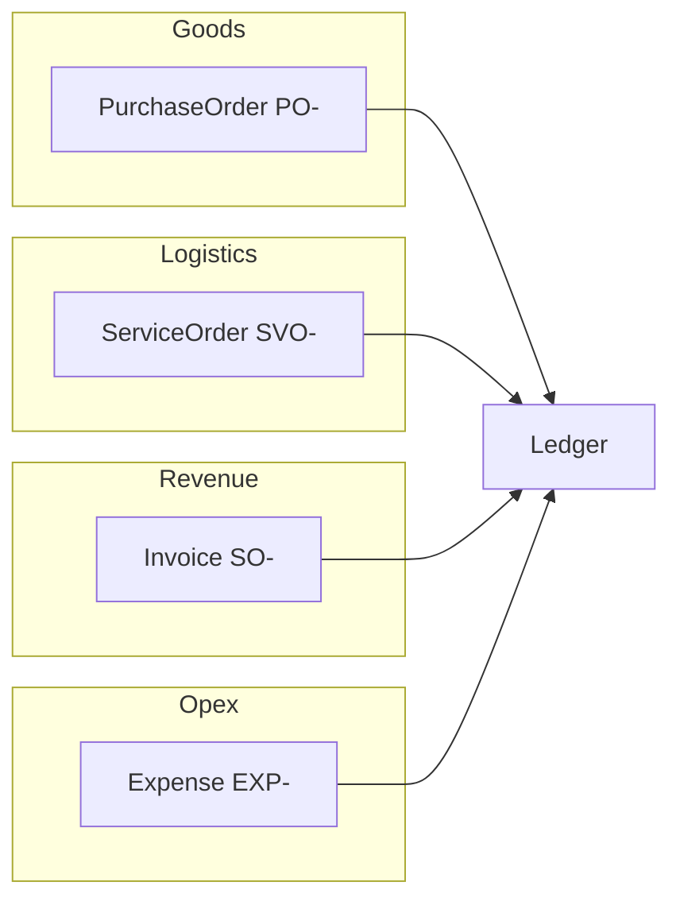

# Service Orders — Application Design

**Requirements:** [service-orders-requirements.md](../requirements/service-orders-requirements.md)  
**Domain:** [vehicle-and-service-costs.md](../requirements/vehicle-and-service-costs.md)

---

## Document model

| Document | Prefix | Table | Party | Ledger type | Purchase column |
|----------|--------|-------|-------|-------------|-----------------|
| Purchase Order | PO- | PurchaseOrder | Supplier | Purchase | Yes |
| Service Order | SVO- | ServiceOrder | Supplier | Service | Yes |
| Sales Order | SO- | Invoice | Customer | Sales | No (Sale column) |
| Expense | EXP- | Expense | Supplier (opt) | Expense | Yes |

---

## Schema

### ServiceOrder

Mirrors `PurchaseOrder` plus:

- `serviceCategory text NOT NULL` — `TRANSPORT` | `INSPECTION` | `SHIPPING` | `VANNING` | `OTHER`

### ServiceOrderLine

Mirrors `PurchaseOrderLine` with `serviceOrderId` FK.

### Attachment

Add nullable `serviceOrderId` FK (cascade delete).

---

## Lifecycle

Same bill model as PO (`packages/shared/src/svo/status.ts`):

| Status | Transitions |
|--------|-------------|
| DRAFT | → POSTED, CANCELLED |
| POSTED | → VOID; payment updates |
| VOID | terminal |
| CANCELLED | terminal |

Posted SVO appears on ledger when `status = POSTED` and `issueDate` in range.

---

## Numbering

`nextServiceOrderNumber(year)` → `SVO-${year}-NNNN` (same sequence logic as PO).

---

## Ledger integration

- `LedgerDocType`: add `"SVO"`
- `fetchLedgerEntries`: query posted ServiceOrders
- `ledgerPurchaseAmount`: PO, EXP, **SVO** → total; SO → 0
- `sumLedgerTax` / `sumLedgerAmounts`: include posted SVO in input tax and purchases

---

## Migration 0005

1. CREATE `ServiceOrder`, `ServiceOrderLine`
2. ALTER `Attachment` ADD `serviceOrderId`
3. For each legacy PO number (8 rows):
   - Skip if notes already contain `Migrated from PO-…` or SVO number exists
   - INSERT ServiceOrder (new id, renumbered SVO-…, inferred category)
   - COPY lines → ServiceOrderLine (new line ids)
   - UPDATE Attachment: `serviceOrderId`, clear `purchaseOrderId`
   - DELETE PO lines + PO

Category inference (notes + line descriptions, case-insensitive):

| Keywords | Category |
|----------|----------|
| transport, 陸送, 配送 | TRANSPORT |
| inspect, 検査 | INSPECTION |
| ship, 船積, ocean, freight | SHIPPING |
| van, バンニング | VANNING |
| default | OTHER |

---

## Application routes

| Route | Purpose |
|-------|---------|
| `/service-orders` | List + filters |
| `/service-orders/new` | Create draft |
| `/service-orders/[id]` | Detail, edit, post, void, payment, attachments |

Mirror `actions-purchase-orders.ts` → `actions-service-orders.ts`.

---

## i18n keys

`svo.*`, `nav.serviceOrders`, `ledger.type.SVO`, `svo.category.*`
