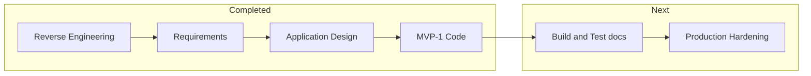

# Execution Plan — MVP-1 Complete

## Status

MVP-1 Construction **completed**. Migration `0001_mvp1_counterparties.sql` applied via `pnpm db:migrate`.

**Infrastructure (2026-06-10):** Course correction — migrated to pnpm monorepo (`apps/web`, `packages/db`, `packages/shared`). Root commands: `pnpm dev`, `pnpm build`, `pnpm db:*`.

## Waves delivered

| Wave | Deliverable | Status |
|------|-------------|--------|
| W1 | Schema: Customer, Supplier, Invoice, PO, payment fields | Done |
| W2 | Customer/Supplier CRUD UI | Done |
| W3 | Invoice draft, issue, PDF, void | Done |
| W4 | PO workflow + receipt attachments | Done |
| W5 | Transaction payment UI + party pickers | Done |
| W6 | i18n EN/JA + nav links | Done |

## Recommended next Construction

| Phase | Rationale |
|-------|-----------|
| Production hardening (FR-NEXT) | Middleware, tests, CI, S3, secrets |
| User Stories for compliance | Before 適格請求書 work |

## Workflow

## Success criteria (MVP-1)

- Create customer → draft invoice → issue PDF → optional SALE with payment tracking
- Create supplier → PO draft → send → partial receive → PURCHASE tx → close
- Upload receipts to transactions and POs (not confused with invoice issuance)
