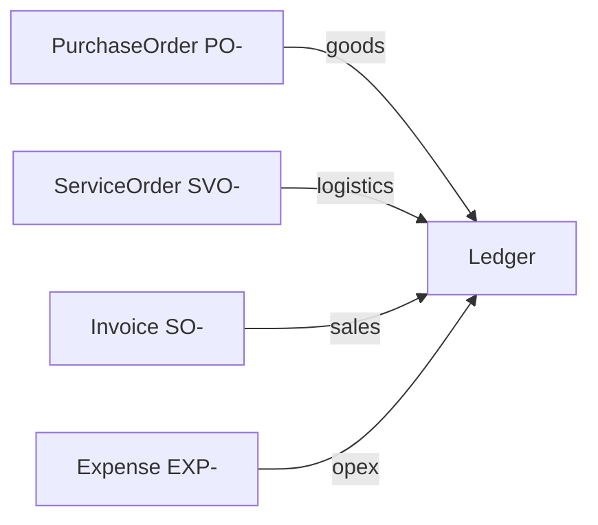

# Vehicle and Service Costs — Domain Research

**Source:** [Explaination.md](../../../Explaination.md) (project root)  
**Project:** SHIME (締) — used-car export bookkeeping  
**Status:** Inception research for Service Order feature

---

## 1. Vehicle purchase cost (仕入高)

When buying vehicles at auction for resale/export, costs to acquire inventory and make it ready for sale are normally **inventory (棚卸資産)**:

| Item | Treatment |
|------|-----------|
| Auction hammer price | Purchase (仕入) → inventory |
| Auction fee (落札料) | Purchase → inventory |
| Auction membership fee (purchase-related) | Purchase → inventory |
| Recycling fee (リサイクル預託金) | **Deposit asset**, not inventory or expense |
| Consumption tax (deductible) | Input tax credit |
| Road tax reimbursement | Receivable/payable adjustment, not vehicle cost |

**Recycling fee:** Many exporters wrongly capitalize this into vehicle cost. In Japan it is generally 預託金 (deposit-type asset). On export, separate recovery/disposal treatment applies.

Example journal:

```
Inventory (Cars)      515,000
Recycling Deposit      10,000
    Accounts Payable        525,000
```

**SHIME mapping:** Record via **Purchase Order (PO-)** for goods vendors (auctions, dealers).

---

## 2. Inland transportation to port

Example: auction yard → Yokohama port, ¥30,000.

| Method | Treatment | When to use |
|--------|-----------|-------------|
| **A (recommended for exporters)** | Capitalize to inventory | True per-vehicle margin |
| **B (simpler)** | Freight expense (荷造運賃) immediately | Small exporters, simpler books |

**SHIME mapping (MVP):** Track vendor bill via **Service Order (SVO-)**; capitalization vs expense posting is **future** (vehicle cost sheet).

---

## 3. Ocean freight / shipping

Example: ocean freight ¥120,000.

| Approach | Treatment |
|----------|-----------|
| Accurate vehicle profitability | Capitalize to inventory → flows to COGS on sale |
| Simpler bookkeeping | Export freight expense |

**SHIME mapping:** **Service Order** with category `SHIPPING`.

---

## 4. PO vs Service Order (business management)

Legally, PO is not required for logistics vendors. What matters: invoice (請求書), contract/booking, payment record.

Exporters often track per vehicle:

| Cost bucket | Examples | SHIME document |
|-------------|----------|----------------|
| Purchase (goods) | Auction price, auction fee | **PO-** |
| Logistics (services) | Inland transport, port handling, ocean freight, vanning, inspection | **SVO-** |
| General opex | Office, utilities | **EXP-** |
| Revenue | Customer sale | **SO-** (Invoice) |

SAP-style systems use "service purchase orders" for freight vendors; SHIME uses a dedicated **ServiceOrder** table with `serviceCategory`.

---

## 5. Vehicle cost sheet (車両原価表) — future

Target operational model per unit:

```
Auction Price         500,000
Auction Fee            15,000
Inland Transport       30,000
Port Charges           20,000
Ocean Freight         120,000
--------------------------------
Total Landed Cost     685,000
```

**Out of scope for Service Order MVP:** vehicle master, linking SVO lines to VIN/stock unit, automatic landed-cost rollup.

---

## 6. Document model summary



Ledger: SVO amounts count in **Purchase** column (outflows), separate **Type** filter for Service.
