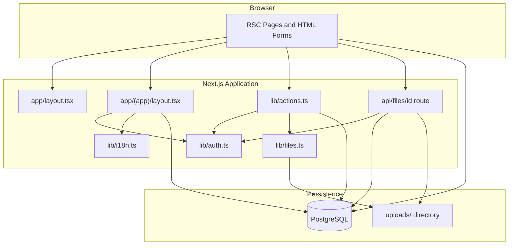
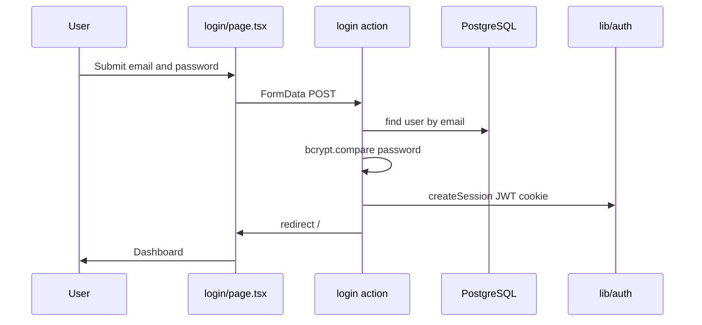
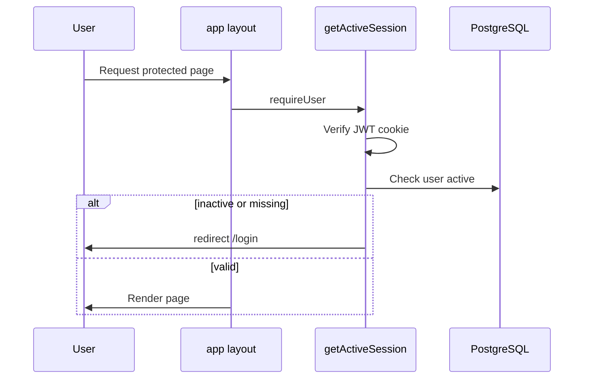
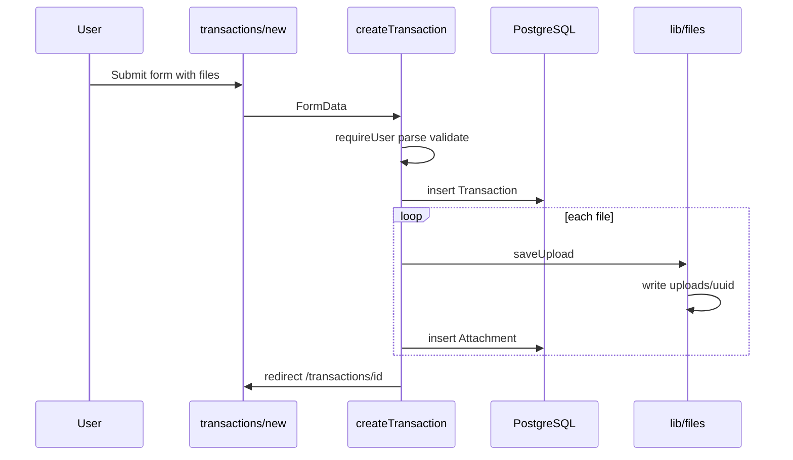
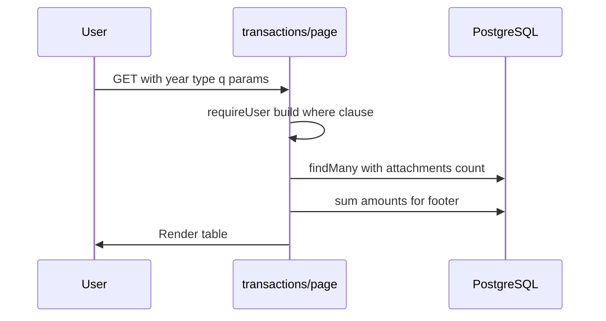
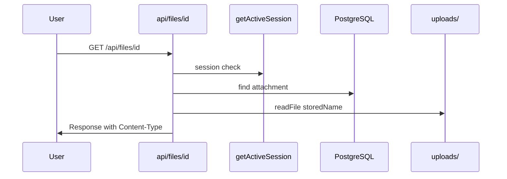
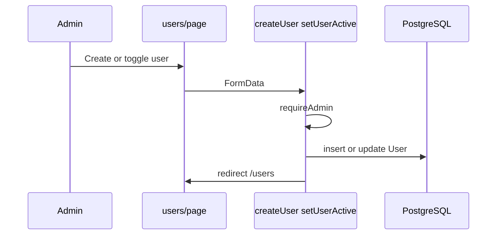
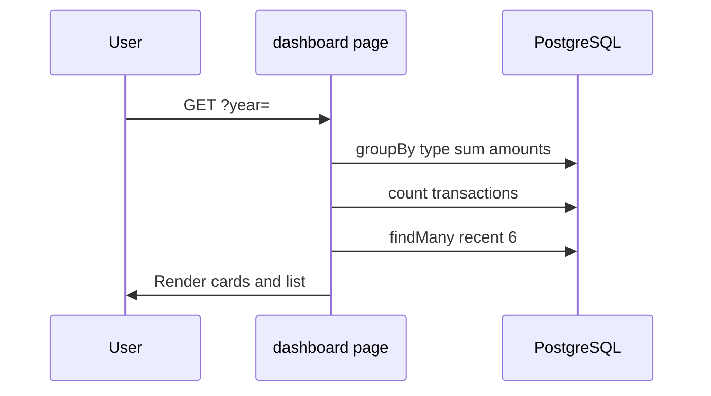

# System Architecture

## System Overview

SHIME is a **pnpm monorepo** with a server-first Next.js 16 application (`apps/web`, package `@shime/web`) using the App Router. Server Components render pages and query PostgreSQL via `@shime/db` (Drizzle ORM). Pure utilities live in `@shime/shared`. Mutations flow through **Server Actions** in `apps/web/lib/actions*.ts`. REST endpoints serve invoice PDFs and attachment binaries with authentication. File uploads land in `apps/web/uploads/` (S3-compatible storage planned for production SaaS).

There is no separate API layer, background job processor, or microservice decomposition in the MVP.

## Architecture Diagram

**Text alternative:** Browser talks to Next.js pages. Protected layout checks auth. Pages read/write PostgreSQL via Drizzle. Mutations go through server actions. Files are written to disk; downloads go through the file API route.

## Component Descriptions

### `app/` — Presentation Layer
- **Purpose**: Route definitions, layouts, and page-level data fetching
- **Responsibilities**: Render UI; call `requireUser`/`requireAdmin`; query Drizzle for read models; bind forms to server actions
- **Dependencies**: `lib/auth`, `lib/db`, `lib/i18n`, `lib/actions`, `components/`
- **Type**: Application

### `lib/actions.ts` — Mutation Layer
- **Purpose**: Centralized server-side command handlers
- **Responsibilities**: Validate form input; enforce auth; persist changes; revalidate cache; redirect with status query params
- **Dependencies**: `lib/auth`, `lib/db`, `lib/files`, `lib/id`
- **Type**: Application

### `lib/auth.ts` — Session Management
- **Purpose**: JWT cookie sessions with live account status check
- **Responsibilities**: `createSession`, `destroySession`, `getActiveSession`, `requireUser`, `requireAdmin`
- **Dependencies**: `jose`, `next/headers`, `lib/db`
- **Type**: Application

### `lib/db/` — Data Access
- **Purpose**: Schema definition and database client
- **Responsibilities**: Drizzle schema, relations, singleton postgres.js connection
- **Dependencies**: `drizzle-orm`, `postgres`
- **Type**: Application / Model

### `lib/files.ts` — Local File Storage
- **Purpose**: Upload persistence on filesystem
- **Responsibilities**: MIME validation, size limits, UUID filenames, delete
- **Dependencies**: Node.js `fs/promises`
- **Type**: Application

### `app/api/files/[id]/route.ts` — File Serving
- **Purpose**: Auth-gated binary delivery
- **Responsibilities**: Session check; lookup attachment metadata; stream file inline or as download
- **Dependencies**: `lib/auth`, `lib/db`, `lib/files`
- **Type**: Application

## Data Flow — Key Business Transactions

### Login

### Session Guard (Protected Routes)

### Create Transaction with Attachments

### List and Filter Transactions

### Serve Attachment

### Admin User Management

### Dashboard Aggregation

## Integration Points

- **External APIs**: None in MVP
- **Databases**: PostgreSQL via `DATABASE_URL` (default local `shime` database)
- **Third-party Services**: None (fonts loaded from Google Fonts at build/runtime via `next/font`)

## Infrastructure Components

- **CDK Stacks**: None
- **Deployment Model**: Local development (`pnpm dev` from monorepo root); production deployment not yet configured. Intended target: multi-tenant SaaS on PostgreSQL with S3-compatible object storage (per README and research doc)
- **Networking**: Single-process Next.js server; no load balancer, VPC, or container orchestration in codebase

## MVP vs. Vision Gap

| Area | MVP (implemented) | Vision (`docs/REQUIREMENTS_RESEARCH.md`) |
|------|-------------------|------------------------------------------|
| Bookkeeping | Simple sale/purchase/expense log | Full chart of accounts, journals, statutory ledgers |
| Compliance | None | Denchōhō, invoice system, retention rules |
| Tax | None | Year-end closing, draft tax schedules, e-Tax export |
| Tenancy | Single shared database | Multi-tenant SaaS |
| Storage | Local `uploads/` | S3-compatible cloud storage |
| Zeirishi workflow | None | Collaboration workspace for tax advisor review |
