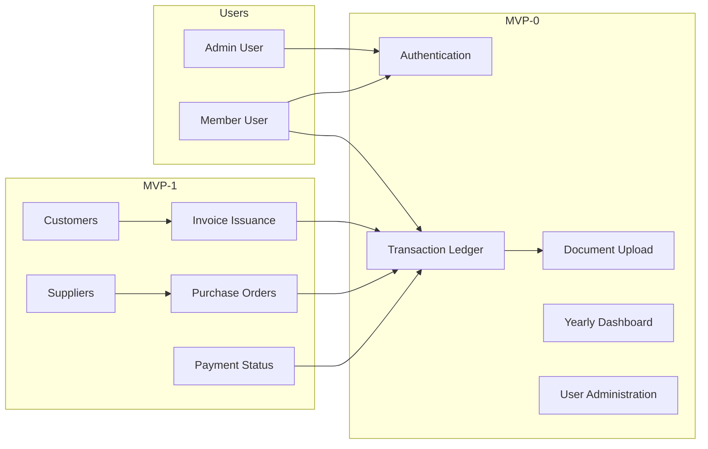

# Business Overview

## MVP Scope Note

- **MVP-0 (as-built):** Ledger transactions (SALE / PURCHASE / EXPENSE), receipt **uploads** as attachments, dashboard, user admin.
- **MVP-1 (in progress):** Customer and Supplier masters, **invoice issuance** (numbered PDF), Purchase Order workflow, payment status on transactions.

**Important:** Uploading a receipt or third-party invoice PDF to a transaction is **not** the same as **creating** a sales invoice in SHIME.

## Business Context Diagram

**Text alternative:** Users record money-in (sales) and money-out (purchases/expenses), upload proof documents, and view yearly totals. MVP-1 adds customer/supplier records, issued invoices, purchase orders, and payment tracking.

## Business Description

- **Business Description**: SHIME (締) is a bilingual bookkeeping application for small businesses in Japan. MVP-0 records sales (売上), purchases (仕入), and expenses (経費) with optional **uploaded** receipt/evidence files. MVP-1 adds structured customers and suppliers, simple PDF invoice creation, full purchase-order workflow, and payment status on ledger entries.

- **Business Transactions (MVP-0)**:
  | Transaction | Description |
  |-------------|-------------|
  | Sign in / Sign out | Email/password session; deactivated users locked out |
  | Record ledger entry | SALE (money in), PURCHASE or EXPENSE (money out) |
  | Upload evidence | Attach image/PDF proof to a transaction (領収書 etc.) |
  | View dashboard | Yearly totals and recent activity |
  | Manage users (admin) | Create and activate/deactivate users |

- **Business Transactions (MVP-1)**:
  | Transaction | Description |
  |-------------|-------------|
  | Manage customers | CRUD customer master; link to sales and invoices |
  | Manage suppliers | CRUD supplier master; link to purchases and POs |
  | Issue invoice | Create numbered PDF invoice with line items for a customer |
  | Manage purchase orders | Draft → sent → partially received → closed |
  | Record payment | Mark transaction unpaid / partial / paid with amount paid |

- **Business Dictionary**:
  | Term | Japanese | Meaning in SHIME |
  |------|----------|------------------|
  | Sale | 売上 | Money in; transaction type `SALE` |
  | Purchase | 仕入 | Stock/cost of goods; type `PURCHASE` |
  | Expense | 経費 | Operating cost; type `EXPENSE` |
  | Attachment | 添付ファイル | Uploaded proof document (receipt, scanned invoice) — **not** issued invoice |
  | Customer | 顧客 | Master record for buyers (MVP-1) |
  | Supplier | 仕入先 | Master record for vendors (MVP-1) |
  | Invoice (issued) | 請求書発行 | Numbered PDF created in SHIME (MVP-1) |
  | Purchase Order | 発注書 | Order document to supplier with lifecycle (MVP-1) |
  | Payment status | 支払状況 | UNPAID / PARTIAL / PAID on a transaction (MVP-1) |
  | Counterparty | 取引先 | Free-text name on transaction (legacy / fallback) |

## Component Level Business Descriptions

### Web Application (Next.js)
- **Purpose**: User-facing bookkeeping product
- **Responsibilities**: Auth, ledger, attachments, customers, suppliers, invoices, POs, dashboard, i18n

### Server Actions (`lib/actions*.ts`)
- **Purpose**: All business mutations
- **Responsibilities**: CRUD for all entities, PO state transitions, invoice PDF generation, payment updates

### Data Store (PostgreSQL)
- **Purpose**: Relational persistence for users, ledger, masters, invoices, POs, attachments

### File Storage (`uploads/`)
- **Purpose**: User uploads and generated invoice PDFs
