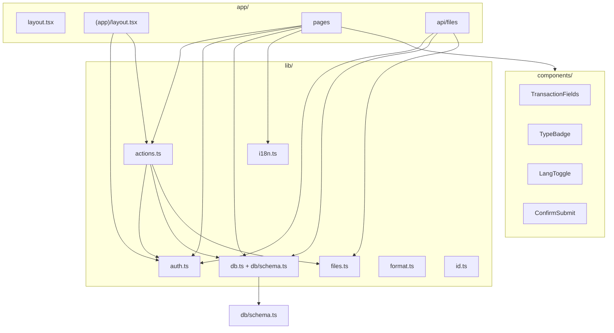

# Code Structure

## Build System

- **Type**: pnpm workspaces (monorepo)
- **Root scripts**: `pnpm dev`, `pnpm build`, `pnpm db:*` — delegate to `@shime/web` and `@shime/db`
- **Packages**:
  - `@shime/web` — `apps/web/` — Next.js app
  - `@shime/db` — `packages/db/` — schema, client, migrations, seed
  - `@shime/shared` — `packages/shared/` — format, payment, PO status, IDs
- **TypeScript**: `tsconfig.base.json` at root; `apps/web/tsconfig.json` with `@/*` alias for web-local imports; workspace packages imported as `@shime/db` and `@shime/shared`
- **Next.js**: `apps/web/next.config.ts` — `transpilePackages` for workspace packages; loads `.env` from repo root
- **CSS**: Tailwind CSS v4 via `apps/web/postcss.config.mjs` and `apps/web/app/globals.css`
- **Linting**: `apps/web/eslint.config.mjs` — `eslint-config-next`

## Key Modules

## Existing Files Inventory

### Application Routes (`app/`)

| File | Purpose |
|------|---------|
| `app/layout.tsx` | Root HTML shell, Geist fonts, `lang` attribute from cookie |
| `app/globals.css` | Tailwind import and theme tokens |
| `app/login/page.tsx` | Login form; redirects if already authenticated |
| `app/(app)/layout.tsx` | Authenticated shell: nav, lang toggle, logout, `requireUser` |
| `app/(app)/page.tsx` | Dashboard: year filter, aggregates, recent transactions |
| `app/(app)/transactions/page.tsx` | Transaction list with year/type/search filters |
| `app/(app)/transactions/new/page.tsx` | Create transaction with optional file uploads |
| `app/(app)/transactions/[id]/page.tsx` | Edit transaction, manage attachments, delete |
| `app/(app)/users/page.tsx` | Admin user list, create, activate/deactivate |
| `app/api/files/[id]/route.ts` | GET handler for auth-gated file serve/download |

### Components (`components/`)

| File | Purpose |
|------|---------|
| `components/TransactionFields.tsx` | Async server component: shared transaction form fields |
| `components/TypeBadge.tsx` | Colored badge for SALE/PURCHASE/EXPENSE |
| `components/LangToggle.tsx` | Client component: set `shime_lang` cookie, refresh |
| `components/ConfirmSubmit.tsx` | Client component: confirm-before-submit for deletes |

### Library (`lib/`)

| File | Purpose |
|------|---------|
| `packages/db/src/schema.ts` | Drizzle table definitions and relations |
| `packages/db/src/client.ts` | postgres.js + Drizzle client singleton |
| `lib/auth.ts` | JWT session cookie management |
| `lib/actions.ts` | All server actions (auth, transactions, attachments, users) |
| `lib/files.ts` | Local upload save/delete, MIME and size validation |
| `lib/i18n.ts` | EN/JA dictionaries, `getLang`, `getT` |
| `lib/format.ts` | `formatYen`, `formatDate`, `formatBytes` |
| `lib/id.ts` | CUID2 `createId` re-export |

### Database (`drizzle/`)

| File | Purpose |
|------|---------|
| `drizzle/migrations/0000_brown_betty_ross.sql` | Initial schema migration |
| `drizzle/migrations/meta/` | Drizzle Kit journal and snapshot |
| `drizzle/seed.ts` | Seed admin user script |
| `drizzle.config.ts` | Drizzle Kit configuration |

### Configuration

| File | Purpose |
|------|---------|
| `package.json` | Dependencies and npm scripts |
| `tsconfig.json` | TypeScript compiler options |
| `next.config.ts` | Next.js configuration |
| `eslint.config.mjs` | ESLint rules |
| `postcss.config.mjs` | PostCSS / Tailwind |
| `.env.example` | Environment variable template |

### Documentation (non-AI-DLC)

| File | Purpose |
|------|---------|
| `README.md` | MVP overview and setup |
| `docs/REQUIREMENTS_RESEARCH.md` | Full platform vision and compliance research |

## Design Patterns

### Server Actions as BFF
- **Location**: `lib/actions.ts`
- **Purpose**: Single mutation surface; no REST API except file download
- **Implementation**: `"use server"` functions called from HTML forms; redirect-based UX

### Server Components First
- **Location**: All pages, most components
- **Purpose**: Minimize client JavaScript; data fetched on server
- **Implementation**: Async RSC pages query Drizzle directly; only `LangToggle` and `ConfirmSubmit` are client components

### Redirect-Based Validation
- **Location**: `lib/actions.ts`
- **Purpose**: Communicate errors/success without client state
- **Implementation**: `redirect("/path?error=required")` or `?saved=1`

### Integer Money
- **Location**: `packages/db/src/schema.ts`, `apps/web/lib/actions.ts`, `packages/shared/src/format.ts`
- **Purpose**: Avoid floating-point in JPY (no fractional unit)
- **Implementation**: `integer` column; `Math.round(Number(...))`; `Intl` currency formatting

### Role-Based Access Control
- **Location**: `lib/auth.ts`, `app/(app)/layout.tsx`, `app/(app)/users/page.tsx`
- **Purpose**: ADMIN manages users; MEMBER manages transactions only
- **Implementation**: `requireAdmin()` redirect; conditional nav link

### Session with Live Account Check
- **Location**: `lib/auth.ts` — `getActiveSession`
- **Purpose**: Deactivated users blocked even with valid JWT
- **Implementation**: JWT verify then DB lookup of `active` flag

## Critical Dependencies

### next (16.2.9)
- **Usage**: App Router, Server Actions, RSC, API routes
- **Purpose**: Full-stack React framework

### drizzle-orm (0.45.1) + postgres (3.4.7)
- **Usage**: `@shime/db`, all data access
- **Purpose**: Type-safe SQL ORM with relational queries

### jose (6.2.3)
- **Usage**: `lib/auth.ts`
- **Purpose**: JWT sign/verify for session cookies

### bcryptjs (3.0.3)
- **Usage**: `lib/actions.ts`, `drizzle/seed.ts`
- **Purpose**: Password hashing (cost factor 10)

### @paralleldrive/cuid2 (3.0.4)
- **Usage**: `lib/id.ts`
- **Purpose**: Primary key generation for all entities
