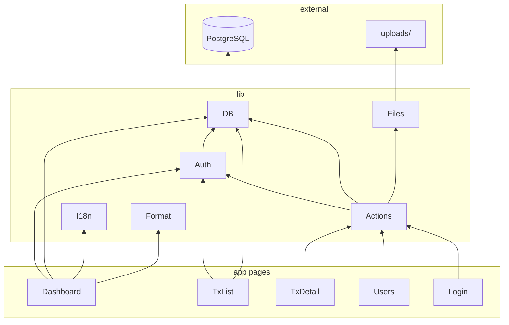

# Dependencies

## Internal Dependencies

### Page layer depends on lib
- **Type**: Compile-time import
- **Reason**: Pages fetch data and render forms bound to server actions

### actions.ts depends on auth, db, files, id
- **Type**: Runtime
- **Reason**: Mutations require session, persistence, and file I/O

### auth.ts depends on db
- **Type**: Runtime
- **Reason**: `getActiveSession` verifies user still active in database

### api/files route depends on auth, db, files
- **Type**: Runtime
- **Reason**: Auth-gated file streaming from disk using DB metadata

## External Dependencies

### Production (`dependencies`)

| Package | Version | Purpose | License |
|---------|---------|---------|---------|
| next | 16.2.9 | Full-stack React framework | MIT |
| react | 19.2.4 | UI library | MIT |
| react-dom | 19.2.4 | React DOM renderer | MIT |
| drizzle-orm | 0.45.1 | ORM | Apache-2.0 |
| postgres | 3.4.7 | PG driver | Unlicense |
| jose | 6.2.3 | JWT | MIT |
| bcryptjs | 3.0.3 | Password hashing | MIT |
| @paralleldrive/cuid2 | 3.0.4 | IDs | MIT |
| dotenv | 17.4.2 | Env for seed script | BSD-2-Clause |

### Development (`devDependencies`)

| Package | Version | Purpose | License |
|---------|---------|---------|---------|
| drizzle-kit | 0.31.9 | Migrations CLI | Apache-2.0 |
| typescript | ^5 | Type checking | Apache-2.0 |
| tsx | 4.22.4 | TS execution | MIT |
| tailwindcss | ^4 | CSS framework | MIT |
| @tailwindcss/postcss | ^4 | PostCSS plugin | MIT |
| eslint | ^9 | Linter | MIT |
| eslint-config-next | 16.2.9 | Next ESLint rules | MIT |
| @types/node | ^20 | Node types | MIT |
| @types/react | ^19 | React types | MIT |
| @types/react-dom | ^19 | React DOM types | MIT |
| @types/bcryptjs | 2.4.6 | bcryptjs types | MIT |

## Dependency Notes

- **No internal package graph**: Single npm package; no monorepo workspaces
- **No optional peer conflicts** observed in lockfile for MVP scope
- **Database coupling**: Application tightly coupled to PostgreSQL via Drizzle; no abstraction for other databases
- **Storage coupling**: `lib/files.ts` directly uses Node `fs`; migration to S3 will require new storage adapter
